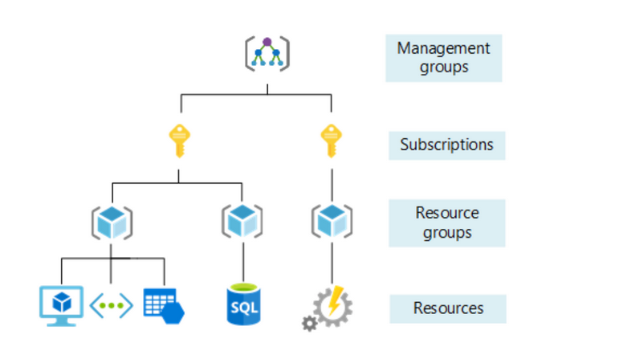
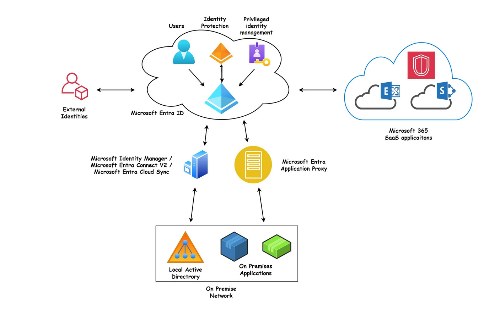

## **2. Azure Architecture and Services**
### **2.1 Core Architectural Components**
#### **Region**
Set of datacenters that are combined to made a region.
Usually region are combined to another region to make a region pair. It will connected via the Optical fiber

Data stored in the regions never leaves the that region because of security reason.
But Brazil region will paired with south central US so the data does leave the Brazil and this is called one way pairing.

Qatar don't have the region pairing but uses the Availability Zones for HA.
#### **Sovereign Regions**
These are not connected to the Azure public cloud
To join this need approval and subscription
Designed to meet **specific regulatory, compliance, or data residency requirements** of a **particular country or government**.
Sovereign regions are mainly created for:

- **Government organizations**
    
- **Public sector agencies**
    
- **Critical infrastructure operators**
    
- **Defense or military entities**
    
- **Enterprises with strict data sovereignty laws**

### **2.2 Availability zones (AZ)**
These are datacenters or set of datacenters are physically separate location within each azure region. 

They have there own there infra like power and cooling systems

Not every region has Availability zones

Not every services supports the Availability zone

**_3 types of Availability zones_**
1. **Zonal services** - Customer can choose the specific availability zone to deploy the service. Ex VM's and you should deploy the duplicate services in another zone to achieve resilience. 
2. **Zone redundant services** - Automatically deployed across zones for the customer. No need to configure
3. **Always available services** - Microsoft ensures that the services are always on. This will be taken care by the CSP. Also called Non Regional Services. Ex: Azure portal, Entra ID etc.
### **2.3 Resource and Resource Group:**

**_Resources_**: Its a generic word to represent an azure services that you have access to such as VM, Storage account or DB.
We can create the resources using the PowerShell, Portal, ARM templates and CLI.
Each resources has a name created by me and need to select the region.
The resource is associated with one subscription, to which costs.

**_Resource Group_:** A logical grouping of resources. Resource group associated with a region, which can be different than the resources it contains.
All services in a resource group should have similar lifecycle, deploy together and delete together.

### **2.3 Subscription**
Its a billing section on the azure.
A single user can have access to multiple subscription with different roles through RBAC

Some companies can choose to have multiple subscription used to separate out the business units with an organization e.g. Sales, IT, Finance or separated by North America, Europe, Asia

#### Management groups
To manage the subscription on a group basis.

### **2.4 Azure Resource Manager**

**[Azure Resource Manager](Definations.md) is the deployment and management service for Azure.** 

- It provides a management layer that helps you to create, update, deploy and delete resources in your Azure account.
- Also it has management features like access control, locks, and tags to secure and organize your resources after deployment.

There are 4 types of ARM
1. Resource group - This contains the information about the resources in the resource group
2. Subscription - This contains the information about the Resource group in an Subscription.
3. Management - This contains the information about the Subscriptions in an Management group.
4. Tenant - This contains the information about the AD (Entra ID) in an tenant.

Only the resource group ARM can be exported from the azure portal and remaining 3 we need to manually create from the VS Code using the Bicep extension.

|**Level**|**Purpose**|**Contains**|
|---|---|---|
|**Tenant**|Identity boundary|Azure AD users, groups, roles|
|**Management Group**|Governance boundary|Subscriptions|
|**Subscription**|Billing and access boundary|Resource groups|
|**Resource Group**|Logical container|Azure resources|

#### Benefits of Resource Manager
- Manage the infrastructure using simple  declarative templates instead of the scripts.
- Deploy, Manage, and Monitor all the resources in the group
- Define the dependencies between resources so they're deployed in the correct order.
- Adding the tags, access control and locking the resources 
### **2.5 Azure compute and Networking services**
### Computing services
The **processing engine** that runs your **applications, websites, or workloads** using Microsoft’s cloud infrastructure.
Compute types in azure
VM, VM scale sets, App services, Azure container Instances, Azure Kubernetes services etc.

**VM** : In computing, **VM** is an abbreviation for **Virtual Machine**.
A **Virtual Machine (VM)** is an emulation of a computer system. It is a software-based computer that runs on a physical machine, often called the **host**. The VM itself is referred to as the **guest**.

In cloud VM will come under the IaaS. Its a slice of physical machine and other part of the physical machine will be used by others

#### Virtual VM scale Set (VMSS)
A group of VM that can be grow and shrink in quantity based on the predefined rule and Two or more virtual machines running the same code. You can increase the size of a VM easily.

Usually based on the monitoring demand, based on time (Schedule) and  based on many other factors

VMSS can handle 100 VM in a single set. But we can configured to increase that to 1000 VMs in single scale set.

### Availability sets
An **Availability Set** makes sure that **not all your VMs go down at the same time** if there’s a hardware failure or Azure performs maintenance in the datacenter.
Availability sets are within the datacenter.

Azure datacenters are divided into:

1. **Fault Domains (FDs):**
    
    - Physical separation :- different power, cooling, and network hardware.
        
    - Protects against **hardware failures** (like power outage or network switch failure).
        
2. **Update Domains (UDs):**
    
    - Logical separation — groups of VMs that Azure updates one at a time during maintenance.
        
    - Protects against **planned maintenance downtime**.
### Proximity Group
A **Proximity Placement Group** ensures your **VMs are located in the same physical datacenter**, so communication between them is **faster and has minimal latency**.

But here Trade off we need to do if we take the Availability set then we need to leave the proximity group because availability set will be little far compare to proximity group

**Availability Set** = spread apart → **more available**, slightly **less performant**  
**Proximity Placement Group** = close together → **more performant**, slightly **less available**

### App services (Web apps)
Running the code in the cloud
No need to have the server management, just need to push the code and the azure will run the code.
No access to hardware
This comes under PaaS

### Container Services
A **container** is a **lightweight, standalone package** that includes an application and everything it needs to run, ensuring **consistency and portability** across environments.
Fastest and easiest to deploy
**Azure Container Instance (ACI)** 
**Azure Container Apps** 
**Azure Kubernetes Services** 

#### Azure Virtual Desktop
Desktop version that runs on the cloud

#### Azure Function
An **Azure Function** is a **serverless compute service** in Microsoft Azure that lets you **run small pieces of code (functions)** in response to **events or triggers** — **without managing servers**.

## **2.6 Azure Networking**
### Virtual Networks (VNet)
**Virtual Networks (VNets)** are **private, isolated networks** inside the Azure cloud that enable **secure communication between Azure resources** such as **Virtual Machines (VMs), databases, and other services**.

### Subnets 
Subnets are smaller sections of a VNet used to group and manage Azure resources logically and securely.

VNETs are assigned to the NIC of the VM
### Network Security Groups (NSG)
It is an ACL that blocks inbound and outbound traffic from a subnet unless it matches certain rules
Rules are based on the Src IP, Dst IP, Ports or protocol

Rule have priority, Highest priority will be checked 1st 
### Network Peer
**By default, communication between subnets within the same VNet is allowed**, but **communication between different VNets is blocked**.  
To enable communication between different VNets, you need to configure **VNet Peering**.
### Azure DNS
We can give the DNS to the IP, which will be worked inside the azure. Its a private DNS.

### VPN Gateway
Allow communication between a system and a network or b/w 2  network.
Encrypts the traffic between 2 points
Inside of azure we need to configure the VPN Gateway

- When a **single computer (client device)** connects securely to an **Azure Virtual Network (VNet)** using VPN, it is called a **Point-to-Site (P2S) VPN**.
    
- When an **entire network (like an on-premises network or branch office)** connects to an **Azure Virtual Network (VNet)** over VPN, it is called a **Site-to-Site (S2S) VPN**.
### Express Route
**Azure ExpressRoute** is a **high-speed, private connection** between your on-premises network and Microsoft Azure, where the network traffic **does not travel over the public internet**.
## **2.7 Azure Storage**
### Container (Blob) storage
BLOB - Binary Large Object
These are files of any type such as txt, pdf, zip, csv etc. It will store the unstructured data in the azure cloud.
This is Pay as you go model.

For redundancy azure will keep 3 copies of the data by default in Locally or zone redundant (For Local and Zone Redundancy this will be applicable)

If you have selected the global redundancy then azure will keep 6 copies, 3 locally and 3 in another region  (Geo and Geo zone)
For the data all the sovereignty laws will be applied

**Access Tiers**
Hot Storage: The default, Higher storage cost, lower access cost
Cool Storage: Cheaper storage and more expensive read/write operation
Cold storage: Much cheaper storage and More expensive in operation
Archive Storage: Cannot get immediate access to files and cheapest storage more expensive to retrieve the data.
#### Comparison Table

| Tier        | Storage Cost | Access Cost | Min Retention | Access Speed       | Type    |
| ----------- | ------------ | ----------- | ------------- | ------------------ | ------- |
| **Hot**     | High         | Low         | None          | Fast               | Online  |
| **Cool**    | Medium       | Medium      | 30 days       | Fast               | Online  |
| **Cold**    | Low          | Higher      | 90 days       | Fast               | Online  |
| **Archive** | Very Low     | Very High   | 180 days      | Slow (rehydration) | Offline |
#### Failover : No need to worry about the hard disk failover, because azure will keep the 3 copy of the data.

Creating an Storage account
Search storage account -> Enter the resource group name, storage name, redundancy, and etc.
Select the required things
To store the files create a container and upload the files.

**Benefits of the AZ Storage:**
Azure File storage and sync
Hierarchical structure of folders
Supports SMB and NFS
We can mount the storage to server and we can use
It will replace the on prem file server with cloud with more storage
Lift and shift migration because cloud is having the backup of files

### Azure Migrate
Migrating the on prem into the cloud example server migration, DB Migration, Web app migration and etc

Go to azure migrate and run the discover 
Next do the compatibility assessment
Give the cost
do the migration
#### Azure Databox
If we have TB's of data, it is very hard to upload the data that time azure will send a databox which is a hardware. We need to fill the data in the databox and send it Microsoft

- Data Box: 100 terabytes
- Data Box Disk: 8 terabytes
- Data Box Heavy: 1 petabyte (more like a small piece of furniture)

## **2.8 Identity access and Management**

Identity is digital representation of a person, application or a device

Microsoft Entra ID : Identity management for azure
Entra ID uses SAML, OAuth for the authentication
Entra ID will handle authentication and authorization task

#### Authentication and authorization
Authentication is proving who are you like user id and password
Authorization is "**What are you allowed to do?"** It’s the process of checking **permissions / access rights** after authentication.

#### Single sign on (SSO)

**SSO** allows a user to log in **once** and gain access to **multiple applications** without needing to sign in again for each one.

You have 10 different application means you need to have the 10 different username and password. Instead of this if you logged in to0 the single site and if you open the other site or application it will automatically login to the application using the same username and password this is SSO.

### How It Works

1. You log in once to an **Identity Provider (IdP)** like **Microsoft Entra ID**, **Okta**, or **Google Identity**.
    
2. The IdP issues a **token** proving your identity.
    
3. When you open another connected app, it checks for that token — if it’s valid, you’re logged in automatically.

Every application should be registered with the  Entra to enable this feature.

We can set the conditional access rules as per the location, IP, Time, Devices, user name, and application

### Role Based Access Control

To **control and secure access to resources** by creating and assigning **Role-Based Access Control (RBAC)** roles to users, groups, or service principals.
**RBAC (Role-Based Access Control)** allows you to decide **who can do what** on **which resources** in Azure.

**3 Basic roles**
1. Reader - Just reading they cant able to change the resources
2. Contributor - Full access to the resource but they cant assign the roles to others
3. Owner -Full access to the resource

#### Zero trust model
Every connection — incoming or outgoing — should be **verified, authenticated, and authorized** before it’s allowed.

This concept is part of the **Zero Trust Security Model**, which means:  
**“Never trust, always verify.”**

##### Principles
1. Verify explicitly
2. Least privilege
3. Assume breach
#### Defense in Depth
**Defense in Depth** is a **security strategy** that uses **multiple layers of protection** — both technical and administrative — to safeguard data, applications, and infrastructure. like encryption, access control, antivirus, monitoring, and backups — to make it much harder for attackers to succeed
### Azure Context (Layered Security Model):

| **Security Layer**        | **Azure Example**                                                 | **Purpose**                                              |
| ------------------------- | ----------------------------------------------------------------- | -------------------------------------------------------- |
| **Physical Security**     | Azure Datacenter protections (guards, cameras, restricted access) | Prevent unauthorized physical access.                    |
| **Identity & Access**     | Microsoft Entra ID, MFA, RBAC                                     | Verify user identities and limit access.                 |
| **Perimeter Layer**       | Azure Firewall, DDoS Protection                                   | Protect against external attacks and network intrusions. |
| **Network Layer**         | Network Security Groups (NSGs), VPNs, VNet segmentation           | Restrict traffic flow and isolate resources.             |
| **Compute Layer**         | Secure configurations, VM patching, endpoint protection           | Protect virtual machines and workloads.                  |
| **Application Layer**     | Web Application Firewall (WAF), code scanning                     | Secure web apps and APIs from attacks like SQLi, XSS.    |
| **Data Layer**            | Encryption (at rest & in transit), Azure Key Vault                | Protect sensitive data from unauthorized access.         |
| **Monitoring & Response** | Defender for Cloud, Sentinel, Log Analytics                       | Detect, alert, and respond to security incidents.        |

## Security
The attackers always focus on the cloud because of the data size that is available on the cloud is huge.
Cloud providers are always spends millions amount on the security to safeguard the data and do the security audit and compliance certification
Providers always give the tools to customers to monitor the security related events

How is it achieved?
Following the compliance
Microsoft security response center (MSRC)
Azure policy
Entra ID
RBAC
Always update platform services
Encryption by default
Using security services like firewall

### **2.9 Governance**
How your organization does business.
The process of defining, implementing and monitoring a framework of policies that guides an organizations cloud operations.

**Why it is needed?**
Wants to ensure the policies are followed 
Includes basic auditing and reporting and enforcement
Compliant with standards such as HIPAA or PCC GDPR

**How is it achieved?**
Azure policy and blueprint
Management groups to manage the group and policies
Custom roles - Which role belongs to which work
Soft delete - Minimum time the data will be stored after deleting the data

